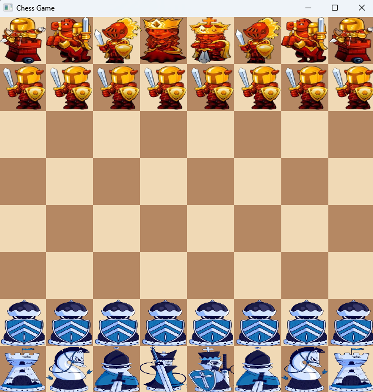
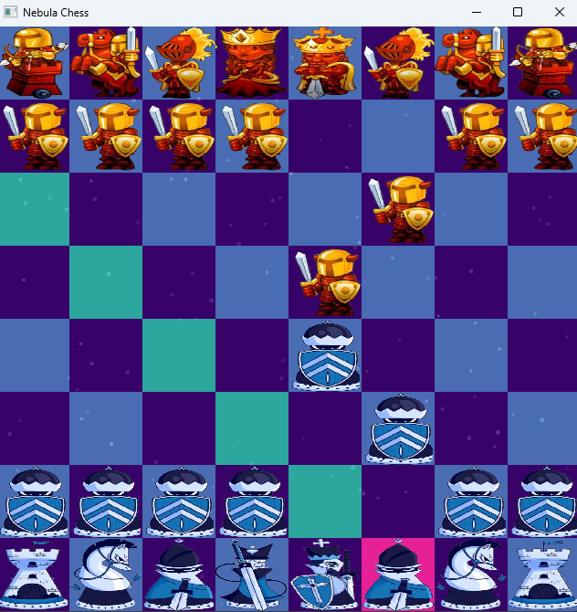

The following repo is for the creation of a chess-game using C++, unreal engine for graphics and potentially the making of some ai to play against.

Plan:

Future Plans:

Fix Error msg logic: FIXED

Fix the UI a bit Done can do more

Add logging with SFML maybe

Add undo move

Add En passant logic

Add a bot to play against

Do it in 3d later to learn unreal engine

Project development progress:

Originally:

<pre>
 r n b q k b n r 
 p p p p p p p p 
 X X X X X X X X 
 X X X X X X X X 
 X X X X X X X X 
 X X X X X X X X 
 P P P P P P P P 
 R N B Q K B N R
</pre>

The Initial Board Gui:

Updated Board:

